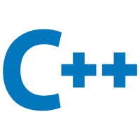
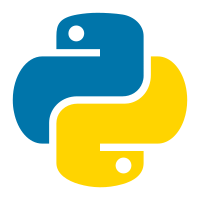
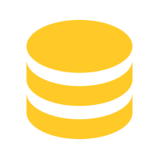

<h1 align="center">
  🎉Welcome to MrCai's GitHub Home Page!
  
</h1>

## 👨‍💻 My Profile

- 🏫 **Studying** at UESTC, China.
- 💓 **Interested** in `Python`:
  - 🖇️ Webspider _(Requests, Scrapy, Selenium...)_
  - 🖋️ Data Analysis _(Numpy, Pandas, Matplotlib...)_
  - 🤖 Automation _(PyQt5, Pywinauto, xlwings...)_
  - 🔆 Others _(Pytorch, Wordcloud, PIL...)_
- 📖 **Learning** `Web` Development. (Just getting started!) Looking for someone to study together!
- 💬 **Reach me** through QQ directly (best way): `1014305148`, or QQ mail (less recommended).
- 📜 **Personal Blog** at [mrcai.space](https://mrcai.space).

## 📈 My Stats

|||
|---|---|

## 🗃️ My Stack

<table>
  <tr>
    <td align="center" width="96">
        
       C
    </td>
    <td align="center" width="96">
        
       C++
    </td>
    <td align="center" width="96">
        
       Python
    </td>
    <td align="center" width="96">
        
       Go
    </td>
    <td align="center" width="96">
        
       Markdown
    </td>
    <td align="center" width="96">
        
       Java
    </td>
    <td align="center" width="96">
        
       MySQL
    </td>
  </tr>
  <tr>
    <td align="center" width="96"> 
        
       HTML
    </td>
    <td align="center" width="96">
        
       CSS
    </td>
    <td align="center"  width="96">
        
       JavaScript
    </td>
    <td align="center"  width="96">
        
       Batchfile
    </td>
    <td align="center"  width="96">
        
       MATLAB
    </td>
    <td align="center" width="96">
        
       Verilog
    </td>
    <td align="center"  width="96">
        
       Git
    </td>
  </tr>
</table>

## 🔍 Maybe you are looking for...

|Tool|Project|
|---|---|
|||
|||

<h2 align="center">✨Living, learning, developing.✨</h2>
